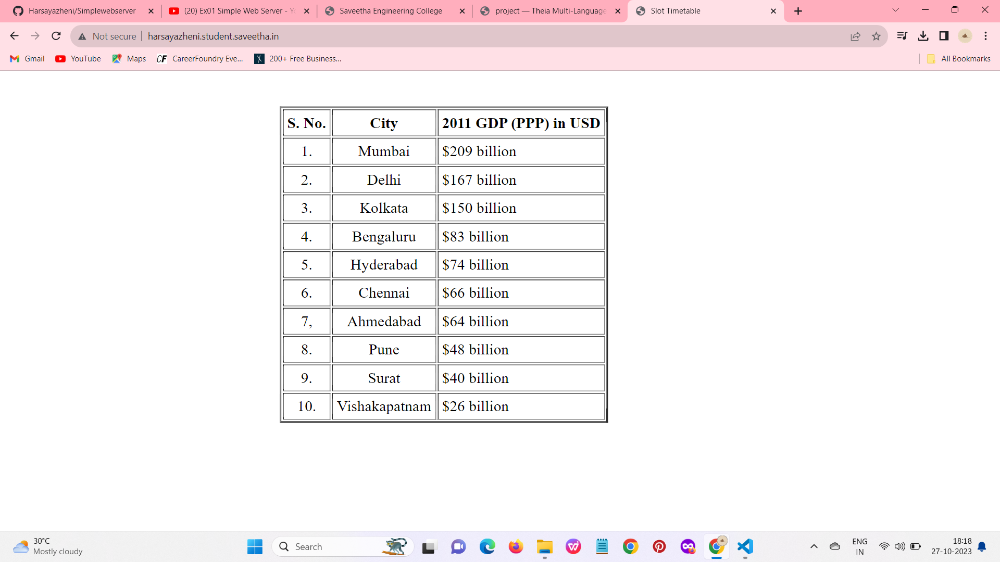
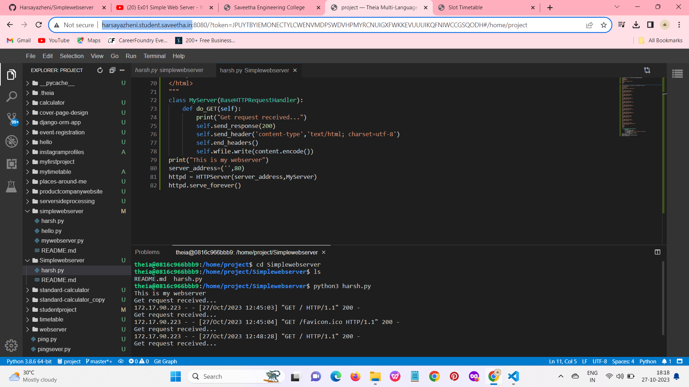

# Developing a Simple Webserver
## AIM:
To develop a simple webserver to serve html pages.

## DESIGN STEPS:
### Step 1: 
HTML content creation
### Step 2:
Design of webserver workflow
### Step 3:
Implementation using Python code
### Step 4:
Serving the HTML pages.
### Step 5:
Testing the webserver

## PROGRAM:
```
from http.server import HTTPServer,BaseHTTPRequestHandler
content="""
<!DOCTYPE html>
<html lang="en">
<head>
<title>Slot Timetable</title>
</head>
<body>
<br>

<br>
<table align="center" cellspacing="2" cellpadding="4" border="2">
<tr align="center">
<th>S. No.</th>
<th>City</th>
<th>2011 GDP (PPP) in USD</th></th>
</tr>
<tr>
<td align="center">1.</td>
<td align="center">Mumbai</td>
<td>$209 billion</td>
</tr>
<tr>
<td align="center">2.</td>
<td align="center">Delhi</td>
<td>$167 billion</td>
</tr>
<tr>
<td align="center">3.</td>
<td align="center">Kolkata</td>
<td>$150 billion</td>
</tr>
<tr>
<td align="center">4.</td>
<td align="center">Bengaluru</td>
<td>$83 billion</td>
</tr>
<tr>
<td align="center">5.</td>
<td align="center">Hyderabad</td>
<td>$74 billion</td>
</tr>
<tr>
<td align="center">6.</td>
<td align="center">Chennai</td>
<td>$66 billion</td>
</tr>
<tr>
<td align="center">7,</td>
<td align="center">Ahmedabad</td>
<td>$64 billion</td>
</tr>
<tr>
<td align="center">8.</td>
<td align="center">Pune</td>
<td>$48 billion</td>
</tr>
<tr>
<td align="center">9.</td>
<td align="center">Surat</td>
<td>$40 billion</td>
</tr>
<tr>
<td align="center">10.</td>
<td align="center">Vishakapatnam</td>
<td>$26 billion</td>
</tr>
</table>
</body>
</html>
"""
class MyServer(BaseHTTPRequestHandler): 
    def do_GET(self):
        print("Get request received...")
        self.send_response(200)
        self.send_header('content-type','text/html; charset=utf-8')
        self.end_headers()
        self.wfile.write(content.encode())
print("This is my webserver")
server_address=('',80)
httpd = HTTPServer(server_address,MyServer)
httpd.serve_forever()
```

## OUTPUT:



## RESULT:
Thus, program for executing simplewebserver has been executed successfully.
